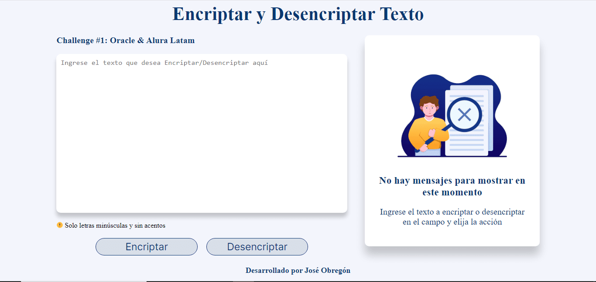

# Encriptar y Desencriptar Texto
### Desarrollado por José Obregón durante el Challenge del curso de Oracle y Alura Latam
<div align="center">
  
</div>
<div align="center">
  
  
  
</div>

## Descripción
Este es un programa que te permite encriptar y desencriptar texto utilizando un algoritmo de sustitución. Aunque es fácil de usar, se recomienda utilizarlo solo con fines prácticos, ya que el algoritmo de sustitución es relativamente simple y puede ser descifrado con facilidad. Por lo tanto, no se recomienda su uso en casos donde se requiera un nivel de seguridad más alto.

<!-- --- -->

## Llaves de encriptacion

- La letra "**a**" es convertida a "**ai**".
- La letra "**e**" es convertida a "**enter**".
- La letra "**i**" es convertida a "**imes**".
- La letra "**o**" es convertida a "**ober**"
- La letra "**u**" es convertida a "**ufat**"

<!-- --- -->

## Funcionamiento
<!-- ``` -->
Ejemplo:
Encriptar: "gato" => "gaitober"
Desencriptar: "gaitober" => "gato"
<!-- ``` -->

<a href="https://obregon-jose.github.io/Encriptador-de-Texto/" style="display: inline-block; padding: 10px 20px; font-size: 16px; color: white; background-color: #007bff; border-radius: 10px; text-decoration: none; transition: background-color 0.3s;">
  ¡Probar Encriptador!
</a>
